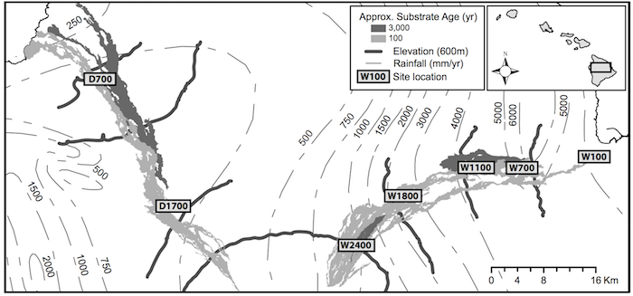

```{r setup, include = FALSE}
knitr::opts_chunk$set(comment = "", cache = TRUE, crop = TRUE)
knitr::knit_hooks$set(crop = knitr::hook_pdfcrop)
```

## Workshop logistics

* Etherpad 
    * https://public.etherpad-mozilla.org/p/ESA2017-intro-vegan

## Workshop logistics

* Etherpad 
    * https://public.etherpad-mozilla.org/p/ESA2017-intro-vegan
* Red and Green Stickies 
  
&nbsp;&nbsp;&nbsp;&nbsp;

## Packages installed (and loaded)?

```{r load-libraries, eval=FALSE}
install.packages("vegan", dependencies = TRUE)
install.packages("permute")
library("vegan")
```

### Data downloaded from github?  
https://github.com/naupaka/esa_intro_vegan_2016

## Introduction to **vegan** | a potted history

 * Jari Oksanen released first version of vegan to CRAN on September 5th 2001
 * Limited scope; purpose was to have Peter Minchin's DECODA-like functions for NMDS available in R plus helper functions
 * By version 1.4, vegan had DCA & CCA, with RDA following in 1.4.2. `ordisurf()` appeared in 1.4 also as did permutation tests.
 * From version 1.6, vegan expanded into areas of theoretical ecology and diversity
 * Version 1.6.5 brought the `metaMDS()` wrappers for NMDS
 * Since then vegan has rapidly developed on the R-Forge website and expanded considerably
 * Current development team: Jari Oksanen, F. Guillaume Blanchet, Roeland Kindt, Pierre Legendre, Peter R. Minchin, R. B. O'Hara, Gavin L. Simpson, Peter Solymos, M. Henry H. Stevens, Helene Wagner

## Introduction to **vegan** | vegan today

 * The current stable release is version 2.4-0 which is available from CRAN
 * [http://cran.r-project.org/web/packages/vegan]()
 * Development is mainly conducted via [github](https://github.com/vegandevs/vegan) with a separate development version
 * Github also hosts our bug tracking, but we use R-Forge for mailing lists \& forums which should be first port of call for getting help
 * [http://r-forge.r-project.org/projects/vegan]()
 * Also several vignettes (manuals/guides) containing R code to explain how vegan works
 * The vegan tutorial is available at [http://vegan.r-forge.r-project.org]()

## Digging in | Prepping your data for R and vegan

### “The purpose of computing is insight, not numbers” 
### - Richard Hamming 

## Digging in | Prepping your data for R and vegan

### “The purpose of computing is insight, not numbers” 
### - Richard Hamming 
<br /><br /><br />
But you have to get through the numbers to get to the insight...

## Digging in | Prepping your data for R and vegan

We've all heard data horror stories


# Cleaning and importing data

## Loading data and then checking
```{r dirty-data-1, eval=FALSE}
setwd("your/working/directory/")
```

## Loading data and then checking
```{r dirty-data-2, eval=TRUE}
BCI.small.csv.in <- read.csv("data/BCI_small_broken.csv", header = TRUE)
summary(BCI.small.csv.in)
```

## Cleaning your data for R and vegan

...worked example...

## Cleaning your data for R and vegan

### Loading cleaned data and then checking
```{r dirty-data-3, eval=TRUE}
BCI.small.csv.in <- read.csv("data/BCI_small_fixed.csv", header = TRUE, row.names = 1)
```

Then...  
```{r dirty-data-4}
head(BCI.small.csv.in, n = 3)
```

## Cleaning your data for R and vegan

Then...  
```{r dirty-data-5}
summary(BCI.small.csv.in)
```

## Loading your species by site matrix into R

We will now switch to using a microbial ecology dataset, which we will load directly (from Zimmerman and Vitousek 2012)

```{r loading-MLM-1, results='hide'}
MLM.otus <- read.csv("data/MLM_data_otus.csv", row.names = 1, header = TRUE)
MLM.env <- read.csv("data/MLM_data_env.csv", header = TRUE)
```

```{r head-MLM}
head(MLM.otus[,1:3], n = 3)
```

## Loading your species by site matrix into R

```{r head-MLM-2}
head(MLM.env[,1:7], n = 3)
```

# Basic data summarizing

## Summarizing data with `apply()` | sums and sorting

**Sum of rows**
```{r MLM-apply-1}
sum.of.rows <- apply(MLM.otus, 1, sum)
sort(sum.of.rows, decreasing = TRUE)[1:8] #top 8 rows (plots) 
```

## Summarizing data with `apply()` | sums and sorting

**Sum of rows**
```{r BCI-apply-2}
sum.of.rows <- apply(MLM.otus, 1, sum)
sort(sum.of.rows, decreasing = TRUE)[1:8] #top 8 rows (plots) 
```
**Sum of columns**
```{r BCI-apply-3}
sum.of.columns <- apply(MLM.otus, 2, sum)
sort(sum.of.columns, decreasing = TRUE)[1:3] #top 3 columns (species)
```

## Summarizing data with `apply()` | sums and sorting

**Number of plots in which each spp. occurs**
```{r MLM-apply-4}
spec.pres <- apply(MLM.otus > 0, 2, sum) 
sort(spec.pres, decreasing = TRUE)[1:18]
```

# Data Transformation

## Basic data transformation

**Square root transformation**
```{r MLM-sqrt}
head(MLM.otus[,1:3], n = 3)
```

## Basic data transformation

**Square root transformation**
```{r MLM-sqrt-2}
head(MLM.otus[,1:3], n = 3)
spec.sqrt <- sqrt(MLM.otus)
head(spec.sqrt[,1:3], n = 3)
```

## Data transformation in vegan with `decostand()`

**Total**
```{r MLM-decostand-total}
head(MLM.otus[,1:3], n = 3)
```

## Data transformation in vegan with `decostand()`

**Total**
```{r decostand-total-2}
head(MLM.otus[,1:3], n = 3)
spec.total <- decostand(MLM.otus, method = "total", MARGIN = 1) # by rows (sites)
head(spec.total[,1:3], n = 3)
```

## Data transformation in vegan with `decostand()`

**Maximum**
```{r decostand-max-1}
head(MLM.otus[,1:3], n = 3)
```

## Data transformation in vegan with `decostand()`

**Maximum** 
```{r decostand-max-2}
head(MLM.otus[,1:3], n = 3)
spec.max <- decostand(MLM.otus, method = "max", MARGIN = 2) # by columns (species)
head(spec.max[,1:3], n = 3)
```

## Data transformation in vegan with `decostand()`

**Presence-Absence**
```{r decostand-pa-1}
head(MLM.otus[,1:3], n = 3)
```

## Data transformation in vegan with `decostand()`

**Presence-Absence**
```{r decostand-pa-2}
head(MLM.otus[,1:3], n = 3)
spec.pa <- decostand(MLM.otus, method = "pa")
head(spec.pa[,1:3], n = 3)
```

## Data transformation in vegan with `decostand()`

**Hellinger (Legendre & Gallagher 2001)**    
Square root of method "total"
```{r decostand-hellinger-1}
head(MLM.otus[,1:3], n = 3)
```

## Data transformation in vegan with `decostand()`

**Hellinger (Legendre & Gallagher 2001)**     
Square root of method "total"
```{r decostand-hellinger-2}
head(MLM.otus[,1:3], n = 3)
spec.hellinger <- decostand(MLM.otus, method = "hellinger", MARGIN = 1) # on rows (sites)
head(spec.hellinger[,1:3], n = 3)
```

## Data transformation in vegan with `decostand()`

**Wisconsin double standardization**      
Shortcut function for standardizing species to maximum, then sites by totals.  
```{r wisconsin-1}
head(MLM.otus[,1:3], n = 3)
```

## Data transformation in vegan with `decostand()`

**Wisconsin double standardization**    
Shortcut function for standardizing species to maximum, then sites by totals.
```{r wisconsin-2}
head(MLM.otus[,1:3], n = 3)
spec.wisc <- wisconsin(MLM.otus)
head(spec.wisc[,1:3], n = 3)
```

# Calculating community distances

## Calculating distances with `vegdist()` | so many distance metrics, so little time!

### Many different community distance metrics are available in `vegdist()`    
*manhattan, euclidean, canberra, bray, kulczynski, jaccard, gower, altGower, morisita, horn, mountford, raup, binomial, chao, or cao*

## Calculating distances with `vegdist()` | so many distance metrics, so little time!

### Many different community distance metrics are available in `vegdist()`   
*manhattan, euclidean, canberra, bray, kulczynski, jaccard, gower, altGower, morisita, horn, mountford, raup, binomial, chao, or cao*

```{r dist-jacc-1}
spec.jaccpa <- vegdist(MLM.otus, method = "jaccard", binary = TRUE)
# returns an object of class 'dist'
str(spec.jaccpa) 
```

## Calculating distances with `vegdist()` | so many distance metrics, so little time!

```{r dist-jacc-2}
as.matrix(spec.jaccpa)[1:4,1:4]
```

## Calculating distances with `vegdist()` | so many distance metrics, so little time!

### How to choose a good one for your data set?  
### First step, read the help for vegdist
```{r vegdist-help, eval=FALSE}
?vegdist
```

## Calculating distances with `vegdist()` | so many distance metrics, so little time!

### Second, try `rankindex()`    
Higher rank correlations indicate better separation along gradients
```{r rankindex-1}
rank.elev <- rankindex(MLM.env$elevation_m, MLM.otus, indices = 
              c("bray", "euclid", "manhattan", "horn"), method = "spearman")
rank.elev
```

## Calculating distances with `vegdist()` | so many distance metrics, so little time!

### Second, try `rankindex()`    
Can also use on standardized data
```{r rankindex-2}
rank.elev.wisc <- rankindex(MLM.env$elevation_m, wisconsin(MLM.otus), indices = 
              c("bray", "euclid", "manhattan", "horn"), method = "spearman")
rank.elev.wisc
```

## Calculating distances with `vegdist()` | comparison

```{r rankindex-3}
sort(rank.elev, decreasing = TRUE)
sort(rank.elev.wisc, decreasing = TRUE)
```

## Activity

There is a data file in the workshop repositiory, in the `01-intro-basics/data/` folder called `varespec.xlsx`.  

1. Download this file (which has errors)
2. Make a copy
3. Clean it up
4. Load it into R
5. Try at least two different methods to standardize the data.
6. Load the corresponding environmental data with `data(varechem)`
7. Evaluate at least five different community distance metrics with `rankindex()`
8. Calculate community distances using that metric


# Diversity metrics

## Alpha diversity

Basic counts of richness for each plot or site
```{r alpha-1}
site.richness <- apply(MLM.otus > 0, 1, sum)
site.richness[1:7]
```

## Alpha diversity | Other metrics

Fisher's alpha
```{r alpha-2}
site.fisher <- fisher.alpha(MLM.otus)
site.fisher[1:7]
```

## Alpha diversity | Other metrics

Shannon diversity
```{r alpha-3}
site.shannon <- diversity(MLM.otus, index = "shannon", MARGIN = 1)
site.shannon[1:7]
```

## Rarefaction

This is the same as `apply(BCI > 0, MARGIN = 1, sum)`    
it gives the species count for each plot
```{r rarefac-1}
MLM.S <- specnumber(MLM.otus)
```
This finds the plot with the least number of individuals
```{r rarefac-2}
# could also use rowsums() instead of apply()
MLM.raremax <- min(apply(MLM.otus, 1, sum))
```

## Rarefaction

Rarefy MLM species matrix to the minimum number of individuals in any plot    
and plot the relationship between observed and rarefied counts (plus add 1-1 line)
```{r rarefac-3, fig.height=4}
MLM.Srare <- rarefy(MLM.otus, MLM.raremax)
plot(MLM.S, MLM.Srare, xlab = "Observed No. of Species", ylab = "Rarefied No. of Species")
abline(0, 1)
```

## Rarefaction

Put it all together
```{r rarefac-4, fig.height=5.5}
rarecurve(MLM.otus, step = 20, sample = MLM.raremax, col = "blue", cex = 0.6)
```

## Beta diversity {.smaller}

Multivariate homogeneity of groups dispersions
```{r beta-1}
MLM.bray <- vegdist(MLM.otus, method = "bray")
(MLM.bray.bdisp <- betadisper(MLM.bray,group = as.factor(MLM.env$site_ID)))
```

## Beta diversity {.smaller}

Multivariate homogeneity of groups dispersions
```{r beta-2}
permutest(MLM.bray.bdisp)
```

## Beta diversity

Plot of within-group multivariate dispersion
```{r beta-3, fig.height=4.5}
plot(MLM.bray.bdisp)
```

## Beta diversity

Boxplot of within-group multivariate dispersion
```{r beta-4, fig.height=4.5}
boxplot(MLM.bray.bdisp, las = 3)
```

## Beta diversity | ANOSIM Analysis of similarities

BE CAREFUL, VERY SENSITIVE TO MULTIVARIATE HETEROSKEDASTICITY
```{r beta-5, fig.height=4.5}
(MLM.bray.anosim <- anosim(MLM.bray, MLM.env$site_ID))
```

## Beta diversity | ANOSIM Analysis of similarities
 
```{r beta-6, fig.height=4.5}
plot(MLM.bray.anosim)
```

# Study design, testing hypotheses, and PERMANOVAs

## PERMANOVA using `adonis`

The key conceptual thing is to decide what is exchangeable (hence permutable) under the null hypothesis you are trying to test.

You can't always test all the things you might be interested in at once in all designs.

## PERMANOVA using `adonis` | {.smaller}

Analysis of variance using distance matrices and for fitting linear models to distance matrices
```{r adonis-1}
adonis(MLM.otus ~ MLM.env$elevation_m)
```

## PERMANOVA using `adonis` | {.smaller}

Thinking about study design and how to permute samples. <br /><br />
<br />
Sites from the Mauna Loa Environmental matrix in Hawai'i.

## PERMANOVA using `adonis` | Substrate Age {.smaller}

Thinking about study design and how to permute samples (old way using `strata`)
```{r adonis-2}
adonis(MLM.otus ~ MLM.env$flow_age, strata = MLM.env$site_ID)
```

## PERMANOVA using `adonis` | Substrate Age

The main thing with `permute` is to understand the levels of the hierarchy:

1. **within**: how to permute samples at lowest level
2. **plots**: how are samples grouped; permutations are restricted to be
*within* plots; plots can also be permuted too or instead of samples
3. **blocks**: these sit atop the hierarchy - samples within plots within
blocks; blocks are *never* permuted

You can replicate old `strata` arg in vegan's permutation code by
setting either `plots` or `blocks` to be a factor variable.

## PERMANOVA using `adonis` | Substrate Age

Thinking about study design and how to permute samples (new way using `permute` package)
```{r adonis-3}
h1 <- how(plots = Plots(MLM.env$site_ID))

# returns max number of permutations given constraints
check(MLM.otus, control = h1)
```

## PERMANOVA using `adonis` | Substrate Age {.smaller}

```{r adonis-4}
adonis(MLM.otus ~ MLM.env$flow_age, permutations = h1)
```

## PERMANOVA using `adonis` | Substrate Age

```{r adonis-5, eval=FALSE}
# lots more detail in the help
?how

# check out the new, more flexible, but often slower sister function:
?adonis2
```


