# Ordination with vegan
Naupaka Zimmerman and Gavin Simpson  
August 6, 2017 • ESA 2017  


# Ordination types

## Constrained vs unconstrained ordination

**What does it mean?**

* In **unconstrained ordination**, first we look for major variation, then we try to attribute it to environmental variation
* vs. **constrained ordination** (a.k.a. direct gradient analysis), where we only want to see what can be explained by environmental variables of interest

## Constrained ordination

**What does it mean?**

* In **unconstrained ordination**, first we look for major variation, then we try to attribute it to environmental variation
* vs. **constrained ordination** (a.k.a. direct gradient analysis), where we only want to see what can be explained by environmental variables of interest

**Examples of constrained ordination:**

* Canonical Correspondance Analysis - CCA
* Redundancy Analysis - RDA

## Unconstrained ordination

**What does it mean?**

* In **unconstrained ordination**, first we look for major variation, then we try to attribute it to environmental variation
* vs. **constrained ordination** (a.k.a. direct gradient analysis), where we only want to see what can be explained by environmental variables of interest

**Examples of unconstrained ordination:**

* Correspondance Analysis - CA
* Principal Components Analysis - PCA
* Principal Coordinates Analysis - PCoA
* Nonmetric Multidimensional Scaling - NMDS

## Unconstrained ordination

**What does it mean?**

* In **unconstrained ordination**, first we look for major variation, then we try to attribute it to environmental variation
* vs. **constrained ordination** (a.k.a. direct gradient analysis), where we only want to see what can be explained by environmental variables of interest

**Examples of unconstrained ordination:**

* Correspondance Analysis - CA
* Principal Components Analysis - PCA
* Principal Coordinates Analysis - PCoA
* **Nonmetric Multidimensional Scaling - NMDS**

## Side note on resources I have found helpful


<br />

# Ordination plots

## Before we get started

Housekeeping

```r
setwd("your/working/dir")
```


```r
library("vegan")
MLM.otus <- read.csv("data/MLM_data_otus.csv", row.names = 1, header = TRUE)
MLM.env <- read.csv("data/MLM_data_env.csv", row.names = 1, header = TRUE)
```

## Before we get started | OTUs


```r
dim(MLM.otus)
```

```
[1]  130 4583
```

```r
head(MLM.otus[,1:10], n = 1)
```

```
       OTU_0001 OTU_0002 OTU_0003 OTU_0004 OTU_0005 OTU_0006 OTU_0007
w100y1     3430        1       75        3        0        6        0
       OTU_0008 OTU_0009 OTU_0010
w100y1        2      179        0
```

## Before we get started | environment


```r
head(MLM.env, n = 1)
```

```
  Tree_ID site_ID date_collected     UTM_zone Easting Northing elevation_m
1  w100y1   w100y     2009-11-18 NAD83 Zone 5  280572  2179971          92
  side_of_island flow_age site_elevation_m approx_annual_rainfall_mm
1            Wet    Young              100                      3900
  approx_mean_annual_temp_deg_C flow_type
1                          22.2  pahoehoe
```

## Before we get started | environment {.smaller}


```r
summary(MLM.env)
```

```
       X              Tree_ID       site_ID      date_collected
 Min.   :  1.00   d1700y1 :  1   d1700y :10   2009-07-19:31    
 1st Qu.: 33.25   d1700y10:  1   d700o  :10   2009-07-15:30    
 Median : 65.50   d1700y2 :  1   d700y  :10   2009-07-23:20    
 Mean   : 65.50   d1700y3 :  1   w100o  :10   2009-07-17:10    
 3rd Qu.: 97.75   d1700y4 :  1   w100y  :10   2009-11-16:10    
 Max.   :130.00   d1700y5 :  1   w1100o :10   2009-11-17:10    
                  (Other) :124   (Other):70   (Other)   :19    
         UTM_zone      Easting          Northing        elevation_m    
 NAD83 Zone 5:130   Min.   :204253   Min.   :2167409   Min.   :  88.0  
                    1st Qu.:243020   1st Qu.:2174894   1st Qu.: 701.5  
                    Median :251002   Median :2178454   Median :1140.0  
                    Mean   :248966   Mean   :2178870   Mean   :1192.4  
                    3rd Qu.:269343   3rd Qu.:2179814   3rd Qu.:1770.2  
                    Max.   :280654   Max.   :2194919   Max.   :2502.0  
                                                                       
 side_of_island  flow_age  site_elevation_m approx_annual_rainfall_mm
 Dry: 30        Old  :60   Min.   : 100     Min.   : 500             
 Wet:100        Young:70   1st Qu.: 700     1st Qu.:1000             
                           Median :1100     Median :2200             
                           Mean   :1177     Mean   :2673             
                           3rd Qu.:1800     3rd Qu.:4000             
                           Max.   :2400     Max.   :5500             
                                                                     
 approx_mean_annual_temp_deg_C    flow_type  
 Min.   :10.60                 aa      : 20  
 1st Qu.:13.90                 pahoehoe:110  
 Median :17.20                               
 Mean   :16.75                               
 3rd Qu.:18.90                               
 Max.   :22.20                               
                                             
```

## Basic ordination and plotting

There are two basic NMDS ordination functions:

* `isoMDS()` from the MASS package
* `monoMDS()` in vegan

Vegan also has a wrapper function for doing NMDS ordinations using best practices:

* `metaMDS()`

This will do handy things like try to standardize your data if necessary, do a number of random starts to reduce problem of being trapped in local maxima, evaluates potential solutions against each other via procrustes rotation, and performs rotation of the final point cloud, among other things. **You probably want to use this. It's a great place to start.**

## Basic ordination and plotting


```r
MLM.bray.ord <- metaMDS(MLM.otus, distance = "bray", k = 2, trymax = 50)
```

**Show in RStudio**

## Basic ordination and plotting (using all defaults)


```r
plot(MLM.bray.ord)
```

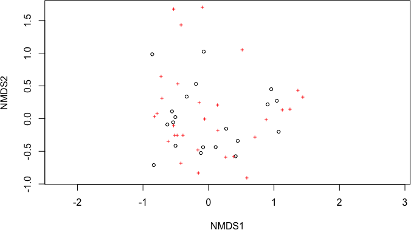

## Basic ordination and plotting (just plots)


```r
plot(MLM.bray.ord, display = "sites")
```

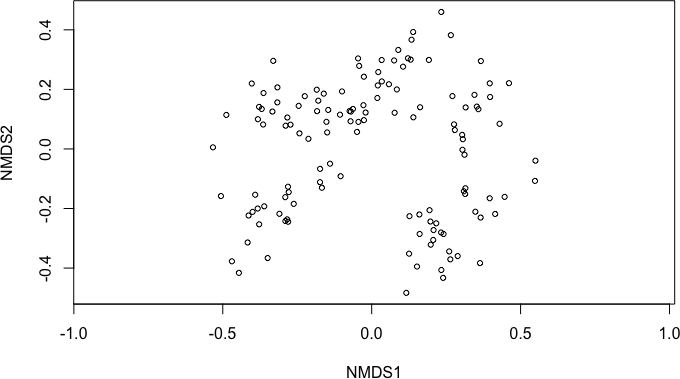

## Basic ordination and plotting (just species)


```r
plot(MLM.bray.ord, display = "species")
```

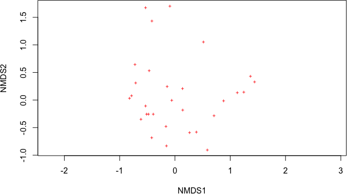

## Site names instead of points


```r
plot(MLM.bray.ord, display = "sites", type = "t")
```

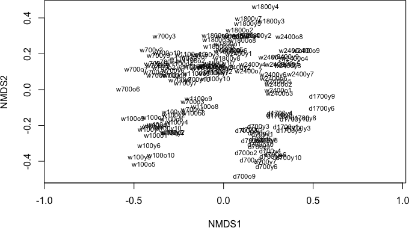

## Site names instead of points


```r
plot(MLM.bray.ord, display = "sites")
set.seed(314) ## make reproducible
ordipointlabel(MLM.bray.ord, display = "sites", scaling = 3, add = TRUE)
```

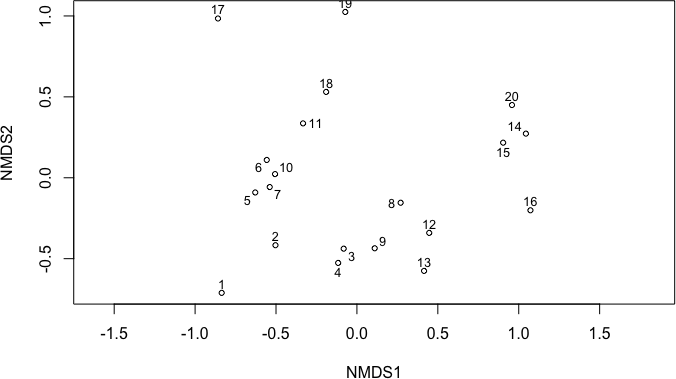

## Site names instead of points


```r
# not going to run this it will take forever
plot(MLM.bray.ord, display = "species")
set.seed(314) ## make reproducible
ordipointlabel(MLM.bray.ord, display = "species", scaling = 3, add = TRUE)
```

## Site names instead of points


```r
plot(MLM.bray.ord)
set.seed(314) ## make reproducible
ordipointlabel(MLM.bray.ord, display = "sites", scaling = 3, add = TRUE)
```

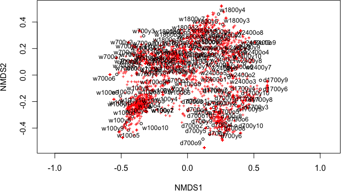<!-- -->

## Larger points


```r
plot(MLM.bray.ord, display = "sites", cex=2)
```

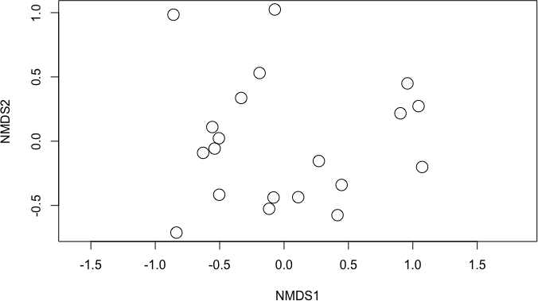

## Modifying the display of the points with environmental data 

* Color
* Shape
* Size


## Modifying the color of points {.smaller}

```r
colors.vec <- c("red", "blue")
plot(MLM.bray.ord, display = "sites", type = "n")
points(MLM.bray.ord, display = "sites", cex=2, pch = 21, 
       col = colors.vec[MLM.env$side_of_island], 
       bg = colors.vec[MLM.env$side_of_island])
legend("topright", legend = levels(MLM.env$side_of_island), bty = "n",
                      col = colors.vec, pch = 21, pt.bg = colors.vec)
```


## Modifying the shape of points | pch()
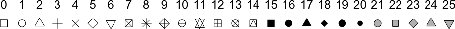 

## Modifying the shape of points {.smaller}

```r
shapes.vec <- c(21, 22)
plot(MLM.bray.ord, display = "sites", type = "n")
points(MLM.bray.ord, display = "sites", cex=2, bg = "black", 
       pch = shapes.vec[MLM.env$flow_type])
legend("topright", legend = levels(MLM.env$flow_type), bty = "n",
                      col = "black", pch = shapes.vec, pt.bg = "black")
```

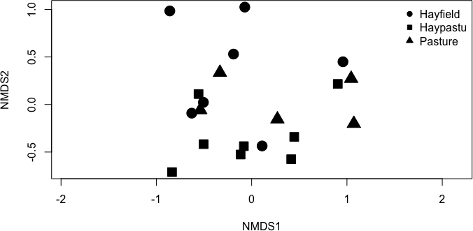

## Modifying the shape and color of points {.smaller}

```r
colors.vec <- c("red", "blue")
shapes.vec <- c(21, 22)
plot(MLM.bray.ord, display = "sites", type = "n")
points(MLM.bray.ord, display = "sites", cex=2, 
       pch = shapes.vec[MLM.env$flow_type], 
       col = colors.vec[MLM.env$side_of_island], 
       bg = colors.vec[MLM.env$side_of_island])
legend("topright", legend = levels(MLM.env$side_of_island), bty = "n",
                      col = colors.vec, pch = 21, pt.bg = colors.vec)
legend(1.4,1.05, legend = levels(MLM.env$flow_type), bty = "n",
                      col = "black", pch = shapes.vec, pt.bg = "black")
```

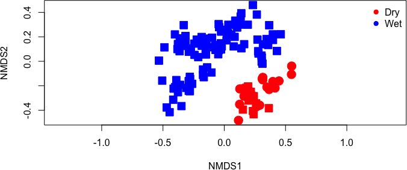

## Adding other layers


```r
# Just points
plot(MLM.bray.ord, display = "sites", cex=2)
```

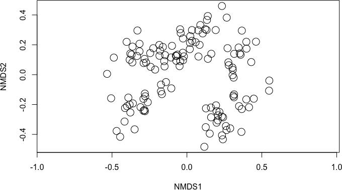

## Adding other layers


```r
plot(MLM.bray.ord, display = "sites", cex=2)
ordihull(MLM.bray.ord, groups = MLM.env$site_ID, label = FALSE)
```

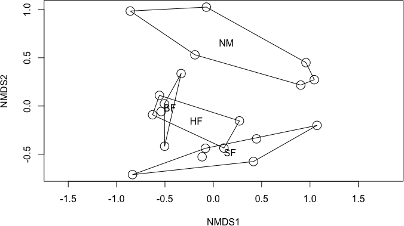

## Adding other layers


```r
plot(MLM.bray.ord, display = "sites", cex=2)
ordihull(MLM.bray.ord, groups = MLM.env$site_ID, label = FALSE, col = "blue")
```

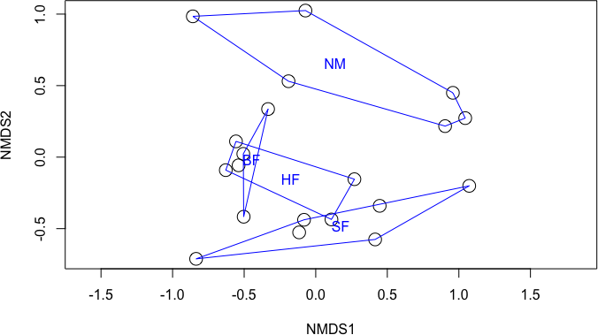

## Adding other layers


```r
plot(MLM.bray.ord, display = "sites", cex=2)
ordihull(MLM.bray.ord,groups = MLM.env$site_ID, label = FALSE, col = "blue")
ordispider(MLM.bray.ord,groups = MLM.env$site_ID, label = TRUE)
```

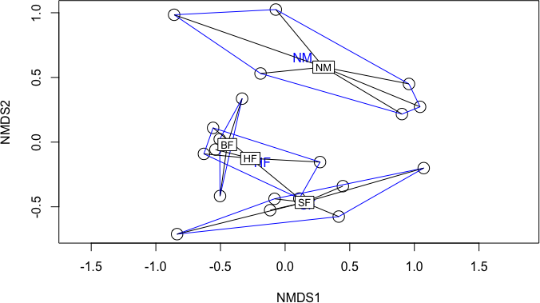

## Adding other layers


```r
# Plot first, then add layers
plot(MLM.bray.ord, display = "sites", cex=2)
```


## Adding other layers


```r
plot(MLM.bray.ord, display = "sites", cex=2)
ordispider(MLM.bray.ord,groups = MLM.env$site_ID, label = TRUE)
```


## Adding other layers - axes scaling


```r
plot(MLM.bray.ord, type = "n")
```

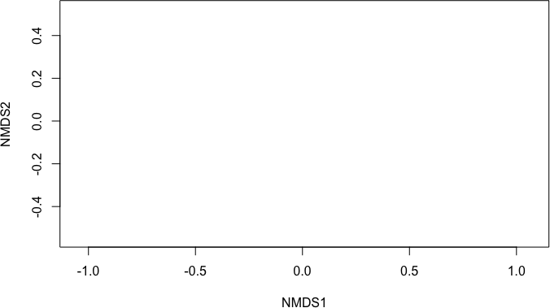

## Adding other layers - axes scaling


```r
plot(MLM.bray.ord, type = "n")
points(MLM.bray.ord,display = "sites", cex = 2)
```

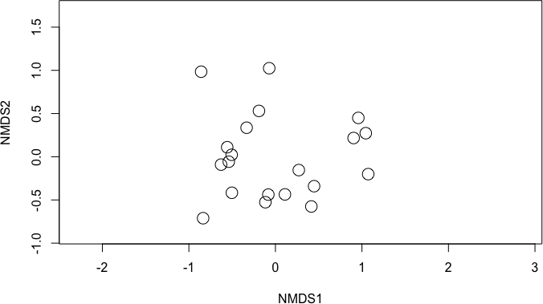

## Adding other layers - axes scaling


```r
plot(MLM.bray.ord, display = "sites", type = "n")
```

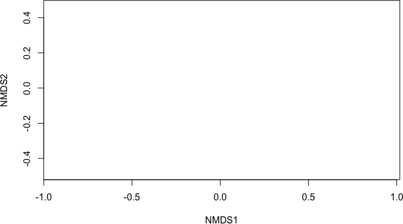

## Adding other layers - axes scaling


```r
plot(MLM.bray.ord, display = "sites", type = "n")
points(MLM.bray.ord, display = "sites", cex = 2)
```


## Adding other layers


```r
plot(MLM.bray.ord, display = "sites", type = "n")
points(MLM.bray.ord,display = "sites", cex = 2)
ordispider(MLM.bray.ord,groups = MLM.env$site_ID, label = TRUE)
```

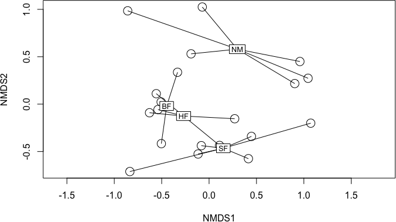

## Adding other layers


```r
plot(MLM.bray.ord, display = "sites", type = "n")
points(MLM.bray.ord, display = "sites", cex = 2)
ordiellipse(MLM.bray.ord,groups = MLM.env$site_ID, label = FALSE)
```

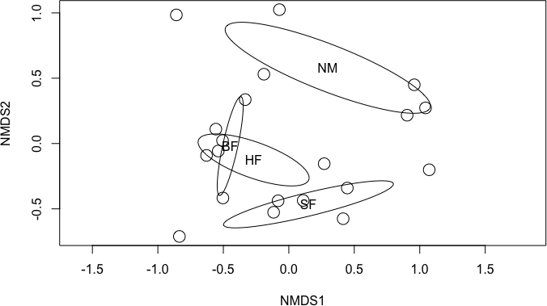

## Adding other layers

```r
plot(MLM.bray.ord, display = "sites", type = "n")
points(MLM.bray.ord,display = "sites", cex = 2)
ordisurf(MLM.bray.ord,MLM.env$elevation_m, add = TRUE)
```

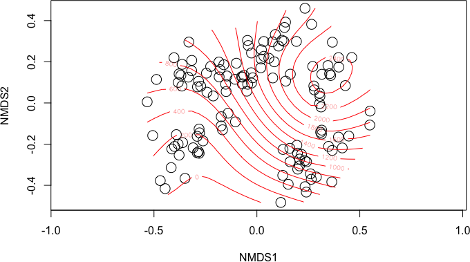

## Vectors in ordination space


```r
MLM.bray.ord.elev.fit <- envfit(MLM.bray.ord ~ elevation_m, 
								data = MLM.env, 
								permutations = 1000)
# count also use, eg: permutations = how(plots = Plots(Your.Env.Data$Your.Plots))
MLM.bray.ord.elev.fit
```

```

***VECTORS

              NMDS1   NMDS2     r2   Pr(>r)    
elevation_m 0.69535 0.71867 0.8263 0.000999 ***
---
Signif. codes:  0 '***' 0.001 '**' 0.01 '*' 0.05 '.' 0.1 ' ' 1
Permutation: free
Number of permutations: 1000
```

## Vectors in ordination space


```r
plot(MLM.bray.ord, display = "sites", type = "n")
points(MLM.bray.ord,display = "sites", cex = 2)
plot(MLM.bray.ord.elev.fit, add = TRUE)
ordisurf(MLM.bray.ord,MLM.env$elevation_m, add = TRUE)
```

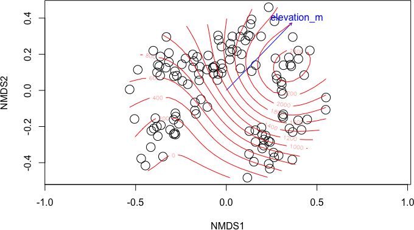

## Activity

Using the cleaned `varespec` data from the last exercise, and the corresponding environmental data, loaded with `data(varechem)`:

1. Load the data
2. Create an NMDS plot using `metaMDS()`
    * use the distance metric you selected earlier
        * if this doesn't work, `bray` is a decent fallback
    * Plot only the sites (not the species)
    * Make the points blue squares, size (cex = 2)
    * Add an `ordisurf` with one of the environmental variables
    * add a title with `main = "title"`
