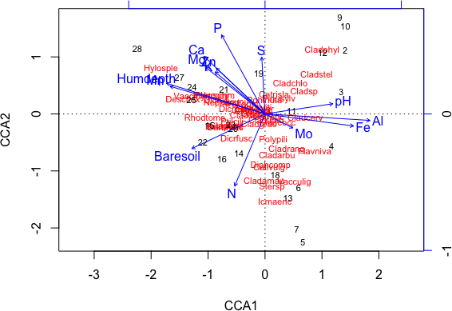
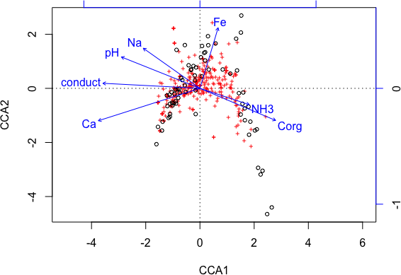
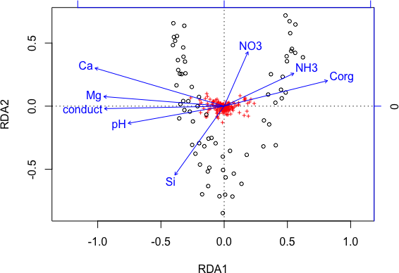

# Constrained Ordination & Permutation Tests
Naupaka Zimmerman and Gavin Simpson  
August 6, 2017 • ESA 2017  


# Constrained Ordination

## Canonical Correspondence Analysis

CCA is the constrained form of CA; fitted using `cca()`.

Two interfaces for specifying models

 * basic; `cca1 <- cca(X = varespec, Y = varechem)`
 * formula; `cca1 <- cca(varespec ~ ., data = varechem)`

Formula interface is the more powerful --- *recommended*

## Canonical Correspondence Analysis


```r
cca1 <- cca(varespec ~ ., data = varechem)
cca1
```

```
Call: cca(formula = varespec ~ N + P + K + Ca + Mg + S + Al + Fe +
Mn + Zn + Mo + Baresoil + Humdepth + pH, data = varechem)

              Inertia Proportion Rank
Total          2.0832     1.0000     
Constrained    1.4415     0.6920   14
Unconstrained  0.6417     0.3080    9
Inertia is mean squared contingency coefficient 

Eigenvalues for constrained axes:
  CCA1   CCA2   CCA3   CCA4   CCA5   CCA6   CCA7   CCA8   CCA9  CCA10 
0.4389 0.2918 0.1628 0.1421 0.1180 0.0890 0.0703 0.0584 0.0311 0.0133 
 CCA11  CCA12  CCA13  CCA14 
0.0084 0.0065 0.0062 0.0047 

Eigenvalues for unconstrained axes:
    CA1     CA2     CA3     CA4     CA5     CA6     CA7     CA8     CA9 
0.19776 0.14193 0.10117 0.07079 0.05330 0.03330 0.01887 0.01510 0.00949 
```

## Redundancy Analysis

RDA is the constrained form of PCA; fitted using `rda()`.


```r
rda1 <- rda(varespec ~ ., data = varechem)
rda1
```

```
Call: rda(formula = varespec ~ N + P + K + Ca + Mg + S + Al + Fe +
Mn + Zn + Mo + Baresoil + Humdepth + pH, data = varechem)

                Inertia Proportion Rank
Total         1825.7000     1.0000     
Constrained   1459.9000     0.7997   14
Unconstrained  365.8000     0.2003    9
Inertia is variance 

Eigenvalues for constrained axes:
 RDA1  RDA2  RDA3  RDA4  RDA5  RDA6  RDA7  RDA8  RDA9 RDA10 RDA11 RDA12 
820.1 399.3 102.6  47.6  26.8  24.0  19.1  10.2   4.4   2.3   1.5   0.9 
RDA13 RDA14 
  0.7   0.3 

Eigenvalues for unconstrained axes:
   PC1    PC2    PC3    PC4    PC5    PC6    PC7    PC8    PC9 
186.19  88.46  38.19  18.40  12.84  10.55   5.52   4.52   1.09 
```

## The `cca.object`

 * Objects of class `"cca"` are complex with many components
 * Entire class described in `?cca.object`
 * Depending on what analysis performed some components may be `NULL`
 * Used for (C)CA, PCA, RDA, and CAP (`capscale()`)

## The `cca.object`

`cca1` has a large number of components

 * **`$call`** how the function was called
 * **`$grand.total`** in (C)CA sum of `rowsum}
 * **`$rowsum`** the row sums
 * **`$colsum`** the column sums
 * **`$tot.chi`** total inertia, sum of Eigenvalues
 * **`$pCCA`** Conditioned (partialled out) components
 * **`$CCA`** Constrained components
 * **`$CA`** Unconstrained components
 * **`$method`** Ordination method used
 * **`$inertia`** Description of what inertia is

## The `cca.object`

Depending on how one called `cca()` etc some of these components will be `NULL`

`$pCCA` is only filled in if a *partial* constrained ordination fitted

`rda()` returns objects with classes `"rda"` and `"cca"`, but in most cases those objects work like those of class `"cca"`

The Eigenvalues and axis scores are now spread about the `$CA` and `$CCA` components (also `$pCCA` if a *partial* CCA)

Thankfully we can use *extractor* functions to get at such things

## Eigenvalues

Use `eigenvals()` to extract Eigenvalues from a fitted ordination object


```r
eigenvals(cca1)
```

```
     CCA1      CCA2      CCA3      CCA4      CCA5      CCA6      CCA7 
0.4388704 0.2917753 0.1628465 0.1421302 0.1179519 0.0890291 0.0702945 
     CCA8      CCA9     CCA10     CCA11     CCA12     CCA13     CCA14 
0.0583592 0.0311408 0.0132944 0.0083644 0.0065385 0.0061563 0.0047332 
      CA1       CA2       CA3       CA4       CA5       CA6       CA7 
0.1977645 0.1419256 0.1011741 0.0707868 0.0533034 0.0332994 0.0188676 
      CA8       CA9 
0.0151044 0.0094876 
```

## Extracting axis scores

To extract a range of scores from  a fitted ordination use `scores()`

 * takes an ordination object as the first argument
 * `choices` --- which axes? Defaults to `c(1,2)`
 * `display` --- which type(s) of scores to return
    - `"sites"` or `"wa"`: scores for samples in response matrix
    - `"species"`: scores for variables/columns in response
    - `"lc"`: linear combination site scores
    - `"bp"`: biplot scores (coords of arrow tip)
    - `"cn"`: centroid scores (coords of factor centroids)

## Extracting axis scores


```r
str(scores(cca1, choices = 1:4, display = c("species","sites")), max = 1)
```

```
List of 2
 $ species: num [1:44, 1:4] 0.0753 -0.1813 -1.0535 -1.2774 -0.1526 ...
  ..- attr(*, "dimnames")=List of 2
 $ sites  : num [1:24, 1:4] 0.178 -0.97 -1.28 -1.501 -0.598 ...
  ..- attr(*, "dimnames")=List of 2
```

```r
head(scores(cca1, choices = 1:2, display = "sites"))
```

```
         CCA1       CCA2
18  0.1784733 -1.0598842
15 -0.9702382 -0.1971387
24 -1.2798478  0.4764498
27 -1.5009195  0.6521559
23 -0.5980933 -0.1840362
19 -0.1102881  0.7143142
```

## Scalings...

When we draw the results of many ordinations we display 2 or more sets of data

Can't display all of these and maintain relationships between the scores

*Solution* scale one set of scores relative to the other

Controlled via the `scaling` argument

 * `scaling = 1` --- Focus on sites, scale site scores by $\lambda_i$
 * `scaling = 2` --- Focus on species, scale species scores by $\lambda_i$
 * `scaling = 3` --- Symmetric scaling, scale both scores by $\sqrt{\lambda_i}$
 * `scaling = -1` --- As above, but
 * `scaling = -2` --- For `cca()` multiply results by $\sqrt{(1/(1-\lambda_i))}$
 * `scaling = -3` --- this is Hill's scaling
 * `scaling < 0` --- For `rda()` divide species scores by species' $\sigma$
 * `scaling = 0` --- raw scores
 

```r
scores(cca1, choices = 1:2, display = "species", scaling = 3)
```

## Partial constrained ordinations

*Partial* constrained ordinations remove the effect of one or more variables *then* fit model of interest

Argument `Z` is used for a data frame of variables to partial out

Or with the formula interface use the `Condition()` function


```r
pcca <- cca(X = varespec,
            Y = varechem[, "Ca", drop = FALSE],
            Z = varechem[, "pH", drop = FALSE])
pcca <- cca(varespec ~ Ca + Condition(pH), data = varechem) ## easier!
```

# Plotting constrained ordinations

## Triplots

Triplots will generally produce a mess; we can really only display a couple of bits approximately anyway

Trying to cram three things in is a recipe for a mess...

...but we can do it


```r
plot(cca1)
```

## Triplots


```r
plot(cca1)
```

 

# Model building

## Building constrained ordination models

If we don't want to think it's easy to fit a poor model with many constraints

That's what we just did with `cca1` and `rda1`

Remember, CCA and RDA are *just regression methods* --- everything you know about regression applies here

A better approach is to *think* about the important variables and include only those

The formula interface allows you to create interaction or quadratic terms easily (though be careful with latter)

It also handles factor or class constraints automatically unlike the basic interface


## Building constrained ordination models


```r
vare.cca <- cca(varespec ~ Al + P*(K + Baresoil), data = varechem)
vare.cca
```

```
Call: cca(formula = varespec ~ Al + P * (K + Baresoil), data =
varechem)

              Inertia Proportion Rank
Total           2.083      1.000     
Constrained     1.046      0.502    6
Unconstrained   1.038      0.498   17
Inertia is mean squared contingency coefficient 

Eigenvalues for constrained axes:
  CCA1   CCA2   CCA3   CCA4   CCA5   CCA6 
0.3756 0.2342 0.1407 0.1323 0.1068 0.0561 

Eigenvalues for unconstrained axes:
    CA1     CA2     CA3     CA4     CA5     CA6     CA7     CA8 
0.27577 0.15411 0.13536 0.11803 0.08887 0.05511 0.04919 0.03781 
(Showed only 8 of all 17 unconstrained eigenvalues)
```

## Building constrained ordination models

For CCA we have little choice but to do

 1. Fit well-chosen set of candidate models & compare, or
 2. Fit a *full* model of well-chosen variables & then do stepwise selection

But automatic approaches to model building should be used cautiously!

The standard `step()` function can be used as **vegan** provides two helper methods, `deviance()` and `extractAIC()`, used by `step()`

Vegan also provides methods for class `"cca"` for `add1()` and `drop1()`

## Variance inflation factors

*Linear* dependencies between constraints can be investigated via the *variance inflation factor* or VIF

VIF is a measure of how much the variance of $\hat{\beta}_j$ is inflated by presence of other covariates

Lots of rules of thumb

 * VIF >= 20 indicates *strong collinearity* in constraints
 * VIF >= 10 potentially of concern & should be looked at

Computed via `vif.cca()`

## Stepwise selection in CCA

`step()` uses AIC which is a fudge for RDA/CCA. Alternatively use function `ordistep()`

 1. Define an upper and lower model scope, say the full model and the null model
 2. To step from the lower scope or null model we use


```r
upr <- cca(varespec ~ ., data = varechem)
lwr <- cca(varespec ~ 1, data = varechem)
set.seed(1)
mods <- ordistep(lwr, scope = formula(upr), trace = 0)
```

`trace = 0` is used her to turn off printing of progress

Permutation tests are used (more on these later); the theory for an AIC for ordination is somewhat loose

## Stepwise selection in CCA

The object returned by `step()` is a standard `"cca"` object with an extra component `$anova`

The `$anova` component contains a summary of the steps involved in automatic model building


```r
mods
```

```
Call: cca(formula = varespec ~ Al + P + K, data = varechem)

              Inertia Proportion Rank
Total          2.0832     1.0000     
Constrained    0.6441     0.3092    3
Unconstrained  1.4391     0.6908   20
Inertia is mean squared contingency coefficient 

Eigenvalues for constrained axes:
  CCA1   CCA2   CCA3 
0.3616 0.1700 0.1126 

Eigenvalues for unconstrained axes:
   CA1    CA2    CA3    CA4    CA5    CA6    CA7    CA8 
0.3500 0.2201 0.1851 0.1551 0.1351 0.1003 0.0773 0.0537 
(Showed only 8 of all 20 unconstrained eigenvalues)
```

## Stepwise selection in CCA

The `$anova` component contains a summary of the steps involved in automatic model building


```r
mods$anova
```

```
     Df    AIC      F Pr(>F)   
+ Al  1 128.61 3.6749  0.005 **
+ P   1 127.91 2.5001  0.005 **
+ K   1 127.44 2.1688  0.035 * 
---
Signif. codes:  0 '***' 0.001 '**' 0.01 '*' 0.05 '.' 0.1 ' ' 1
```

## Stepwise selection in CCA

Step-wise model selection is fairly fragile; if we start from the full model we won't end up with the same final model


```r
mods2 <- step(upr, scope = list(lower = formula(lwr), upper = formula(upr)), trace = 0,
              test = "perm")
mods2
```

```
Call: cca(formula = varespec ~ P + K + Mg + S + Mn + Mo + Baresoil
+ Humdepth, data = varechem)

              Inertia Proportion Rank
Total          2.0832     1.0000     
Constrained    1.1165     0.5360    8
Unconstrained  0.9667     0.4640   15
Inertia is mean squared contingency coefficient 

Eigenvalues for constrained axes:
  CCA1   CCA2   CCA3   CCA4   CCA5   CCA6   CCA7   CCA8 
0.4007 0.2488 0.1488 0.1266 0.0875 0.0661 0.0250 0.0130 

Eigenvalues for unconstrained axes:
    CA1     CA2     CA3     CA4     CA5     CA6     CA7     CA8     CA9 
0.25821 0.18813 0.11927 0.10204 0.08791 0.06085 0.04461 0.02782 0.02691 
   CA10    CA11    CA12    CA13    CA14    CA15 
0.01646 0.01364 0.00823 0.00655 0.00365 0.00238 
```

## Adjusted $R^2$ for *linear* models

As with ordinary $R^2$, that of an RDA is biased for the same reasons as for a linear regression

 * adding a variable to constraints will increase $R^2$
 * the larger the number of constraints in the model the larger $R^2$ is due to random correlations

Can attempt to account for this bias via an *adjusted* $R^2$ measure

$$R^2_{adj} = 1 - \frac{n - 1}{n - m - 1}(1 - R^2)$$

where

 * $n$ is number of samples
 * $m$ is number of constraints (model degrees of freedom)

 * Can be used up to $\sim M > n/2$ before becomes too conservative
 * Can be negative
 * Compute using `RsquareAdj()`

## Stepwise selection via adjusted $R^2$

The problems with stepwise selection in regression models are myriad. Affects RDA, CCA, etc as well

@Blanchet2008 proposed a two-step solution for models where $R^2_{adj}$ makes sense

 * *Global test* of all constraints
     - Proceed **only** if this test is significant
     - Helps prevent inflation of overall type I error
 * Proceed with forward selection, but with *two* stopping rules
     - Usual significance threshold $\alpha$
     - The global $R^2_{adj}$
     - Stop if next candidate model is non-significant or if $R^2_{adj}$ exceeds the global $R^2_{adj}$

Available in `ordiR2step()`

# Permutation tests

## Permutation tests in vegan

RDA has lots of theory behind it, CCA not as much. However, ecological/environmental data invariably violate what little theory we have

Instead we use permutation tests to assess the *importance* of fitted models --- the data are shuffled in some way and the model refitted to derive a Null distribution under some hypothesis of *no effect*

## Permutation tests in vegan

What *is* shuffled and *how* is of **paramount** importance for the test to be valid

 * No conditioning (partial) variables then rows of the species data are permuted
 * With conditioning variables, two options are available, both of which *permute residuals* from model fits
     - The *full model* uses residuals from model $Y = X + Z + \varepsilon$
     - The *reduced model* uses residuals from model $Y = X + Z + \varepsilon$
 * In **vegan** which is used can be set via argument `method` with `"direct"`, `"full"`, and `"reduced"` respectively

## Permutation tests in vegan

A test statistic is required, computed for observed model & each permuted model

**vegan** uses a pseudo-$F$ statistic

$$F=\frac{\chi^2_{model} / df_{model}}{\chi^2_{resid} / df_{resid}}$$

Evaluate whether $F$ is unusually large relative to the null (permutation) distribution of $F$

## Permutation tests in vegan: `anova()`

 * The main user function is the `anova()` method
 * It is an interface to the lower-level function `permutest.cca()`
 * At its most simplest, the \texttt{anova()} method tests whether the ``model'' as a whole is significant
   $$F = \frac{1.4415 / 14}{0.6417 / 9} = 1.4441$$


```r
set.seed(42)
(perm <- anova(cca1))
```

```
Permutation test for cca under reduced model
Permutation: free
Number of permutations: 999

Model: cca(formula = varespec ~ N + P + K + Ca + Mg + S + Al + Fe + Mn + Zn + Mo + Baresoil + Humdepth + pH, data = varechem)
         Df ChiSquare      F Pr(>F)  
Model    14   1.44148 1.4441  0.041 *
Residual  9   0.64171                
---
Signif. codes:  0 '***' 0.001 '**' 0.01 '*' 0.05 '.' 0.1 ' ' 1
```

## Permutation tests in vegan: `anova()`

 * `anova()` will continue permuting only as long as it is uncertain whether the the $p$-value is above or below the chosen threshold (say $p = 0.05$)
 * If the function is sure the permuted $p$ is above the threshold `anova()` may return after only a few hundred permutations
 * In other cases many hundreds or thousands of permutations may be required to say whether the model is above or below the threshold
 * In the example, 1599 permutations were required


```r
perm
```

```
Permutation test for cca under reduced model
Permutation: free
Number of permutations: 999

Model: cca(formula = varespec ~ N + P + K + Ca + Mg + S + Al + Fe + Mn + Zn + Mo + Baresoil + Humdepth + pH, data = varechem)
         Df ChiSquare      F Pr(>F)  
Model    14   1.44148 1.4441  0.041 *
Residual  9   0.64171                
---
Signif. codes:  0 '***' 0.001 '**' 0.01 '*' 0.05 '.' 0.1 ' ' 1
```

## Permutation tests in vegan: `anova()`

 * `anova.cca()` has a number of arguments


```r
args(anova.cca)
```

```
function (object, ..., permutations = how(nperm = 999), by = NULL, 
    model = c("reduced", "direct", "full"), parallel = getOption("mc.cores"), 
    strata = NULL, cutoff = 1, scope = NULL) 
NULL
```

 * `alpha` is the desired $p$ value threshold (Type I error rate)
 * `beta` is the Type II error rate
 * Permuting stops if the result is different from `alpha` for the given `beta`
 * This is evaluated every `step` permutations
 * `perm.max` sets a limit on the number of permutations
 * `by` determines what is tested; the default is to test the model
 * More direct control can be achieved via `permutest.cca()`

## Types of permutation test in vegan

A number of types of test can be envisaged

 * Testing the overall significance of the model
 * Testing constrained (canonical) axes
 * Testing individual model terms *sequentially*
 * The *marginal* effect of a single variable

The first is the default in `anova()`

The other three can be selected via the argument `method`

## Permutation tests | testing canonical axes

 * The constrained (canonical) axes can be individually tests by specifying `by = "axis"`
 * The first axis is tested in terms of variance explained compared to residual variance
 * The second axis is tested after partialling out the first axis... and so on


```r
set.seed(1)
anova(mods, by = "axis")
```

```
Permutation test for cca under reduced model
Marginal tests for axes
Permutation: free
Number of permutations: 999

Model: cca(formula = varespec ~ Al + P + K, data = varechem)
         Df ChiSquare      F Pr(>F)    
CCA1      1   0.36156 5.0249  0.001 ***
CCA2      1   0.16996 2.3621  0.011 *  
CCA3      1   0.11262 1.5651  0.124    
Residual 20   1.43906                  
---
Signif. codes:  0 '***' 0.001 '**' 0.01 '*' 0.05 '.' 0.1 ' ' 1
```

## Permutation tests | testing terms sequentially

 * The individual terms in the model can be tested using `by = "terms"`
 * The terms are assessed in the order they were specified in the model, sequentially from first to last
 * Test is of the additional variance explained by adding the $k$th variable to the model
 * **Ordering of the terms** will affect the results


```r
set.seed(5)
anova(mods, by = "terms")
```

```
Permutation test for cca under reduced model
Terms added sequentially (first to last)
Permutation: free
Number of permutations: 999

Model: cca(formula = varespec ~ Al + P + K, data = varechem)
         Df ChiSquare      F Pr(>F)    
Al        1   0.29817 4.1440  0.001 ***
P         1   0.18991 2.6393  0.011 *  
K         1   0.15605 2.1688  0.024 *  
Residual 20   1.43906                  
---
Signif. codes:  0 '***' 0.001 '**' 0.01 '*' 0.05 '.' 0.1 ' ' 1
```

## Permutation tests | testing terms marginal effects

 * The marginal *effect* of a model term can be assessed using `by = "margin"`
 * The marginal *effect* is the effect of a particular term when all other model terms are included in the model


```r
set.seed(10)
anova(mods, by = "margin")
```

```
Permutation test for cca under reduced model
Marginal effects of terms
Permutation: free
Number of permutations: 999

Model: cca(formula = varespec ~ Al + P + K, data = varechem)
         Df ChiSquare      F Pr(>F)    
Al        1   0.31184 4.3340  0.001 ***
P         1   0.16810 2.3362  0.012 *  
K         1   0.15605 2.1688  0.025 *  
Residual 20   1.43906                  
---
Signif. codes:  0 '***' 0.001 '**' 0.01 '*' 0.05 '.' 0.1 ' ' 1
```

## Constrained ordination worked example | spring meadow vegetation

Example & data taken from Leps & Smilauer, Case Study 2

Spring fen meadow vegetation in westernmost Carpathian mountains


```r
## load vegan
library("vegan")

## load the data
spp <- read.csv("data/meadow-spp.csv", header = TRUE, row.names = 1)
env <- read.csv("data/meadow-env.csv", header = TRUE, row.names = 1)
```

## Constrained ordination worked example | spring meadow vegetation

CCA a reasonable starting point as the gradient is long here (check with `decorana()` if you want)


```r
m1 <- cca(spp ~ ., data = env)
set.seed(32)
anova(m1)
```

```
Permutation test for cca under reduced model
Permutation: free
Number of permutations: 999

Model: cca(formula = spp ~ Ca + Mg + Fe + K + Na + Si + SO4 + PO4 + NO3 + NH3 + Cl + Corg + pH + conduct + slope, data = env)
         Df ChiSquare     F Pr(>F)    
Model    15    1.5597 1.497  0.001 ***
Residual 54    3.7509                 
---
Signif. codes:  0 '***' 0.001 '**' 0.01 '*' 0.05 '.' 0.1 ' ' 1
```

## Constrained ordination worked example | spring meadow vegetation

 

## Constrained ordination worked example | spring meadow vegetation


```r
set.seed(67)
lwr <- cca(spp ~ 1, data = env)
m2 <- ordistep(lwr, scope = formula(m1), perm.max = 499, trace = FALSE)
```

```r
m2
```

```
Call: cca(formula = spp ~ Ca + conduct + Corg + Na + NH3 + Fe +
pH, data = env)

              Inertia Proportion Rank
Total          5.3110     1.0000     
Constrained    0.9900     0.1864    7
Unconstrained  4.3210     0.8136   62
Inertia is mean squared contingency coefficient 

Eigenvalues for constrained axes:
  CCA1   CCA2   CCA3   CCA4   CCA5   CCA6   CCA7 
0.4268 0.1447 0.1116 0.0936 0.0760 0.0719 0.0652 

Eigenvalues for unconstrained axes:
    CA1     CA2     CA3     CA4     CA5     CA6     CA7     CA8 
0.27251 0.19518 0.16703 0.14993 0.14606 0.14168 0.13292 0.12154 
(Showed only 8 of all 62 unconstrained eigenvalues)
```

## Constrained ordination worked example | spring meadow vegetation

 

## Constrained ordination worked example | spring meadow vegetation


```r
m2$anova
```

```
          Df    AIC      F Pr(>F)   
+ Ca       1 453.14 4.7893  0.005 **
+ conduct  1 453.29 1.7915  0.005 **
+ Corg     1 453.61 1.6011  0.005 **
+ Na       1 453.93 1.5827  0.005 **
+ NH3      1 454.36 1.4507  0.020 * 
+ Fe       1 454.89 1.3386  0.015 * 
+ pH       1 455.46 1.2756  0.015 * 
---
Signif. codes:  0 '***' 0.001 '**' 0.01 '*' 0.05 '.' 0.1 ' ' 1
```

## Constrained ordination worked example | spring meadow vegetation

Alternative is RDA with a transformation


```r
spph <- decostand(spp, method = "hellinger")
m3 <- rda(spph ~ ., data = env)
lwr <- rda(spph ~ 1, data = env)
m4 <- ordistep(lwr, scope = formula(m3), perm.max = 199, trace = FALSE)
```

## Constrained ordination worked example | spring meadow vegetation

 

## Constrained ordination worked example | spring meadow vegetation

Stepwise using $R^2_{adj}$


```r
m5 <- ordiR2step(lwr, scope = formula(m3), perm.max = 199, trace = FALSE)
m5$anova
```

```
                 R2.adj Df     AIC       F Pr(>F)   
+ Ca            0.12588  1 -41.779 10.9370  0.002 **
+ NH3           0.14628  1 -42.468  2.6242  0.002 **
+ conduct       0.16322  1 -42.925  2.3570  0.002 **
+ Si            0.17711  1 -43.164  2.1136  0.002 **
+ Corg          0.18518  1 -42.940  1.6442  0.006 **
+ NO3           0.19257  1 -42.680  1.5853  0.018 * 
+ pH            0.19966  1 -42.417  1.5583  0.010 **
<All variables> 0.20332                             
---
Signif. codes:  0 '***' 0.001 '**' 0.01 '*' 0.05 '.' 0.1 ' ' 1
```

## Diagnostics for constrained ordinations

**vegan** provides a series of diagnostics to help assess the model fit

 * `goodness()`
 * `inertcomp()`
 * `spenvcor()`
 * `intersetcor()`
 * `vif.caa()`
 
## Diagnostics for constrained ordinations | goodness of fit

`goodness()` computes two goodness of fit statistics for species or sites

Which goodness of fit measure is returned is controlled by argument `statistic`

 * `statistic = "explained` (default) gives the cumulative proportion of variance explained by each axis
 * `statistic = "distance"` gives the residual distance between the "fitted" location in constrained ordination space and the location in the full dimensional space

## Diagnostics for constrained ordinations | goodness of fit


```r
head(goodness(mods))
```

```
                 CCA1        CCA2      CCA3
Callvulg 0.0062471656 0.318907619 0.8254657
Empenigr 0.1164701677 0.137604904 0.1953245
Rhodtome 0.0999089739 0.169697909 0.1824153
Vaccmyrt 0.2361482843 0.240516323 0.2406730
Vaccviti 0.1523704591 0.156502301 0.2110550
Pinusylv 0.0009244423 0.004802076 0.0060096
```

```r
head(goodness(mods, summarize = TRUE))
```

```
 Callvulg  Empenigr  Rhodtome  Vaccmyrt  Vaccviti  Pinusylv 
0.8254657 0.1953245 0.1824153 0.2406730 0.2110550 0.0060096 
```

## Diagnostics for constrained ordinations | inertia decomposition

`inertcomp()` decomposes the variance in samples or species in partial, constrained, and unconstrained components

Same two types of  measure available by argument `statistic`

 * `statistic = "explained` (default) gives the decomposition in terms of variance
 * `statistic = "distance"` gives decomposition in terms of the the residual distance
 * Can output as proportions of total via `proportion = TRUE`


```r
head(inertcomp(mods, proportional = TRUE))
```

```
               CCA        CA
Callvulg 0.8254657 0.1745343
Empenigr 0.1953245 0.8046755
Rhodtome 0.1824153 0.8175847
Vaccmyrt 0.2406730 0.7593270
Vaccviti 0.2110550 0.7889450
Pinusylv 0.0060096 0.9939904
```

## Diagnostics for constrained ordinations | species-environment correlations

`spenvcor()` returns the species-environment correlation

The (weighted) correlation between the weighted average-based and the linear combination-based sets of site scores

A *poor* measure of goodness of fit. Sensitive to

 * outliers (like all correlations)
 * overfitting (using too many constraints)

Better models can have poorer species-environment correlations


```r
spenvcor(mods)
```

```
     CCA1      CCA2      CCA3 
0.8554808 0.8132873 0.8792797 
```

## Diagnostics for constrained ordinations | interset correlations

`intersetcor()` returns the interset correlations; the (weighted) correlation between the weighted average-based site scores and each constraint variable

Another *poor* diagnostic

 * correlation based
 * focuses on a single constraint--axis combination at a time

Vector fitting (`envfit()`) or biplot scores (`scores(model, display = "bp")`) are better alternatives


```r
intersetcor(mods)
```

```
         CCA1       CCA2      CCA3
Al  0.7356151 -0.1302334 0.4259623
P  -0.3589749 -0.6110772 0.4478933
K  -0.3768462 -0.1339192 0.7760441
```

# Restricted permutation tests

## Restricted permutation tests

What *is* shuffled and *how* is of **paramount** importance for the test to be valid

Complete randomisation (default in **vegan**) assumes a null hypothesis where all observations are *independent*

Ecological / environmental data often aren't independent

 * Temporal or spatial correlation
 * Clustering, repeated measures
 * Nested sampling designs (Split-plots designs)
 * Blocks
 * ...

Permutation *must* give null distribution of the test statistic whilst preserving the *dependence* between observations

Trick is to shuffle the data whilst preserving that dependence

## Restricted permutations

Canoco has had restricted permutations for a *long* time. **vegan** has only recently caught up & we're not there yet

**vegan** still only knows how to completely randomise data or completely randomise within blocks (called `strata` in **vegan**)

The newish package **permute** grew out of initial code in the **vegan** repository to generate the sorts of restricted permutations available in Canoco

We still haven't fully integrated **permute** into **vegan**...

...but you can pass **vegan** functions a matrix of permutations to use instead of having it generate its own

**vegan** depends on **permute** so you should have it already installed & loaded when using **vegan**

## Restricted permutations with **permute**

**permute** follows Canoco closely --- at the chiding of Cajo ter Braak when it didn't do what he wanted !

Samples can be thought of as belonging to three levels of a hierarchy

 * the *sample* level; how are individual samples permuted
 * the *plot* level; how are samples grouped at an intermediate level
 * the *block* level; how are samples grouped at the outermost level

Blocks define groups of plots, each of which can contain groups of samples

## Restricted permutations with **permute**

Blocks are *never* permuted; if defined, only plots or samples *within* the blocks get shuffled & samples never swapped between blocks

Plots or samples within plots, or both can be permuted following one of four simple permutation types

 1. Free permutation (randomisation)
 2. Time series or linear transect, equal spacing
 3. Spatial grid designs, equal regular spacing
 4. Permutation of plots (groups of samples)
 5. Fixed (no permutation)

Multiple plots per block, multiple samples per plot; plots could be arranged in a spatial grid and samples within each of the plots form a time series

## Restricted permutations with **permute** | blocks

Blocks are a random factor that does not interact with factors that vary within blocks

Blocks form groups of samples that are never permuted between blocks, only within blocks

Using blocks you can achieve what the `strata` argument does now in **vegan**; needs to be a factor variable

The variation *between* blocks should be excluded from the test; **permute** doesn't do this for you!

Use `+ Condition(blocks)` in the model formula where `blocks` is a factor containing the block membership for each observation

## Restricted permutations with **permute** | time series & linear transects

Can link *randomly* starting point of one series to any time point of another series if series are stationary under null hypothesis that the series are unrelated

Achieve this via cyclic shift permutations --- wrap series into a circle by joining start and end points

Works OK if there are no trends or cyclic pattern --- autocorrelation structure only broken at the end points *if* series are stationary

Can detrend to make series stationary but not if you want to test significance of a trend


```r
shuffle(10, control = how(within = Within(type = "series")))
```

```
 [1]  9 10  1  2  3  4  5  6  7  8
```

## Restricted permutations with **permute** | spatial grids

<div class="columns-2">
The trick of cyclic shifts can be extended to two dimensions for a regular spatial grid arrangement of points

Now shifts are *toroidal* as we join the end point in the *x* direction together and in the *y* direction together


```r
matrix(perm, ncol = 3)
```

```
     [,1] [,2] [,3]
[1,]    6    9    3
[2,]    4    7    1
[3,]    5    8    2
```
</div>

## Restricted permutations with **permute** | whole-plots & split-plots I

Split-plot designs are hierarchical with two levels of units

 1. **whole-plots** , which contain
 2. **split-plots** (the samples)

Can permute one or both of these but whole-plots must be of equal size

Essentially allows more than one error stratum to be anlyzed

Test effect of constraints that vary *between* whole plots by permuting the whole-plots whilst retaining order of split-splots (samples) within the whole-plots

Test effect of constraints that vary *within* whole-plots by permuting the split-plots within whole-plots without permuting the whole-plots

## Restricted permutations with **permute** | whole-plots & split-plots II

Whole-plots or split-plots can be time series, linear transects or rectangular grids in which case the appropriate restricted permutation is used

If the split-plots are parallel time series & `time` is an autocorrelated error component affecting all series then the same cyclic shift can be applied to each time series (within each whole-plot) (`constant = TRUE`)

## Restricted permutations with **permute** | mirroring

(Without wanting to get *too* technical) Mirroring in restricted permutations allows for isotropy in dependences by reflecting the ordering of samples in time or spatial dimensions

For a linear transect, technically the autocorrelation at lag *h* is equal to that at lag -*h* (also in a trend-free time series)

Hence the series `(1, 2, 3, 4)` and `(4, 3, 2, 1)` are equivalent fom this point of view & we can draw permutations from either version

Similar argument can be made for spatial grids

Using `mirror = TRUE` then can double (time series, linear transects) or quadruple (spatial grids) the size of the set of permutations

## Restricted permutations with **permute** | the set of permutations

Using restricted permutations can severely reduce the size of the set of allowed permutations

As the minimum *p* value obtaininable is $1 / np$ where $np$ is number of allowed permutations (including the observed) this can impact the ability to detect signal/pattern

If we don't want mirroring

 * in a time series of 20 samples the minimum *p* is 1/20 (0.05)
 * in a time series of 100 samples the minimum *p* is 1/100 (0.01)
 * in a data set with 10 time series each of 20 observations (200 total), if we assume an autocorrelated error component over all series (`constant = TRUE`) then there are only 20 permutations of the data and minimum *p* is 0.05

When the set of permutations is small it is better to switch to an exact test & evaluate all permutations in the set rather than randomly sample from the set

## Restricted permutations with **permute** | designing permutation schemes

In **permute**, we set up a permutation scheme with `how()`

We sample from the permutation scheme with

 * `shuffle()`, which gives a single draw from scheme, or
 * `shuffleSet()`, which returns a set of `n` draws from the scheme

`allPerms()` can generated the entire set of permutations --- **note** this was designed for small sets of permutations & is slow if you request it for a scheme with many thousands of permutations!

## Restricted permutations with **permute** | designing permutation schemes

`how()` has three main arguments

 1. `within` --- takes input from helper `Within()`
 2. `plots`  --- takes input from helper `Plots()`
 3. `blocks` --- takes a factor variable as input
 

```r
plt <- gl(3, 10)
h <- how(within = Within(type = "series"), plots = Plots(strata = plt))
```

## Restricted permutations with **permute** | designing permutation schemes

Helper functions make it easy to change one or a few aspects of permutation scheme, rest left at defaults


```r
args(Within)
```

```
function (type = c("free", "series", "grid", "none"), constant = FALSE, 
    mirror = FALSE, ncol = NULL, nrow = NULL) 
NULL
```

```r
args(Plots)
```

```
function (strata = NULL, type = c("none", "free", "series", "grid"), 
    mirror = FALSE, ncol = NULL, nrow = NULL) 
NULL
```

## Restricted permutations with **permute** | designing permutation schemes

`how()` has additional arguments, many of which control the heuristics that kick in to stop you shooting yourself in the foot and demanding 9999 permutations when there are only 10

 * `complete` should we enumerate the entire set of permutations?
 * `minperm` lower bound on the size of the set of permutations at & below which we turn on complete enumeration


```r
args(how)
```

```
function (within = Within(), plots = Plots(), blocks = NULL, 
    nperm = 199, complete = FALSE, maxperm = 9999, minperm = 99, 
    all.perms = NULL, make = TRUE, observed = FALSE) 
NULL
```

## Restricted permutations with **permute** | time series example I

Time series within 3 plots, 10 observation each


```r
plt <- gl(3, 10)
h <- how(within = Within(type = "series"), plots = Plots(strata = plt))
set.seed(4)
p <- shuffle(30, control = h)
do.call("rbind", split(p, plt)) ## look at perms in context
```

```
  [,1] [,2] [,3] [,4] [,5] [,6] [,7] [,8] [,9] [,10]
1    7    8    9   10    1    2    3    4    5     6
2   12   13   14   15   16   17   18   19   20    11
3   24   25   26   27   28   29   30   21   22    23
```

## Restricted permutations with **permute** | time series example II

Time series within 3 plots, 10 observation each, same permutation within each


```r
plt <- gl(3, 10)
h <- how(within = Within(type = "series", constant = TRUE), plots = Plots(strata = plt))
set.seed(4)
p <- shuffle(30, control = h)
do.call("rbind", split(p, plt)) ## look at perms in context
```

```
  [,1] [,2] [,3] [,4] [,5] [,6] [,7] [,8] [,9] [,10]
1    7    8    9   10    1    2    3    4    5     6
2   17   18   19   20   11   12   13   14   15    16
3   27   28   29   30   21   22   23   24   25    26
```

## Restricted permutations with **permute** | worked example with **vegan**

Here by dragons


```r
## Analyse the Ohraz data Case study 5 of Leps & Smilauer

## load vegan
library("vegan")

## load the data
spp <- read.csv("data/ohraz-spp.csv", header = TRUE, row.names = 1)
env <- read.csv("data/ohraz-env.csv", header = TRUE, row.names = 1)
molinia <- spp[, 1]
spp <- spp[, -1]

## Year as numeric
env <- transform(env, year = as.numeric(as.character(year)))
```


```r
## hypothesis 1
c1 <- rda(spp ~ year + year:mowing + year:fertilizer +
          year:removal + Condition(plotid), data = env)

h <- how(within = Within(type = "none"),
         plots = Plots(strata = env$plotid, type = "free"))
set.seed(42)
perm <- shuffleSet(nrow(env), nset = 499, control = h)

anova(c1, permutations = h, model = "reduced")
```

```
Permutation test for rda under reduced model
Plots: env$plotid, plot permutation: free
Permutation: none
Number of permutations: 199

Model: rda(formula = spp ~ year + year:mowing + year:fertilizer + year:removal + Condition(plotid), data = env)
         Df Variance      F Pr(>F)   
Model     4   158.85 6.4247  0.005 **
Residual 90   556.30                 
---
Signif. codes:  0 '***' 0.001 '**' 0.01 '*' 0.05 '.' 0.1 ' ' 1
```

```r
anova(c1, permutations = h, model = "reduced", by = "axis")
```

```
Permutation test for rda under reduced model
Marginal tests for axes
Plots: env$plotid, plot permutation: free
Permutation: none
Number of permutations: 199

Model: rda(formula = spp ~ year + year:mowing + year:fertilizer + year:removal + Condition(plotid), data = env)
         Df Variance       F Pr(>F)   
RDA1      1    89.12 14.4173  0.005 **
RDA2      1    34.28  5.5458  0.005 **
RDA3      1    26.52  4.2900  0.010 **
RDA4      1     8.94  1.4458  0.600   
Residual 90   556.30                  
---
Signif. codes:  0 '***' 0.001 '**' 0.01 '*' 0.05 '.' 0.1 ' ' 1
```


```r
## hypothesis 2
c2 <- rda(spp ~ year:mowing + year:fertilizer + year:removal +
          Condition(year + plotid), data = env)
anova(c2, permutations = h, model = "reduced")
```

```
Permutation test for rda under reduced model
Plots: env$plotid, plot permutation: free
Permutation: none
Number of permutations: 199

Model: rda(formula = spp ~ year:mowing + year:fertilizer + year:removal + Condition(year + plotid), data = env)
         Df Variance      F Pr(>F)   
Model     3    99.24 5.3517  0.005 **
Residual 90   556.30                 
---
Signif. codes:  0 '***' 0.001 '**' 0.01 '*' 0.05 '.' 0.1 ' ' 1
```

```r
anova(c2, permutations = h, model = "reduced", by = "axis")
```

```
Permutation test for rda under reduced model
Marginal tests for axes
Plots: env$plotid, plot permutation: free
Permutation: none
Number of permutations: 199

Model: rda(formula = spp ~ year:mowing + year:fertilizer + year:removal + Condition(year + plotid), data = env)
         Df Variance      F Pr(>F)   
RDA1      1    54.14 8.7595  0.005 **
RDA2      1    34.28 5.5458  0.005 **
RDA3      1    10.82 1.7499  0.500   
Residual 90   556.30                 
---
Signif. codes:  0 '***' 0.001 '**' 0.01 '*' 0.05 '.' 0.1 ' ' 1
```

## References
